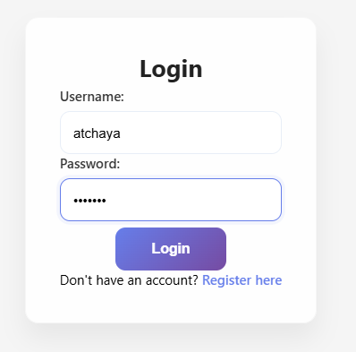
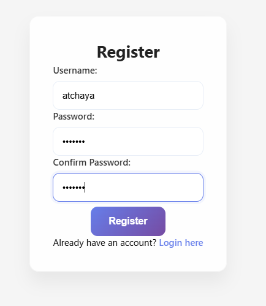
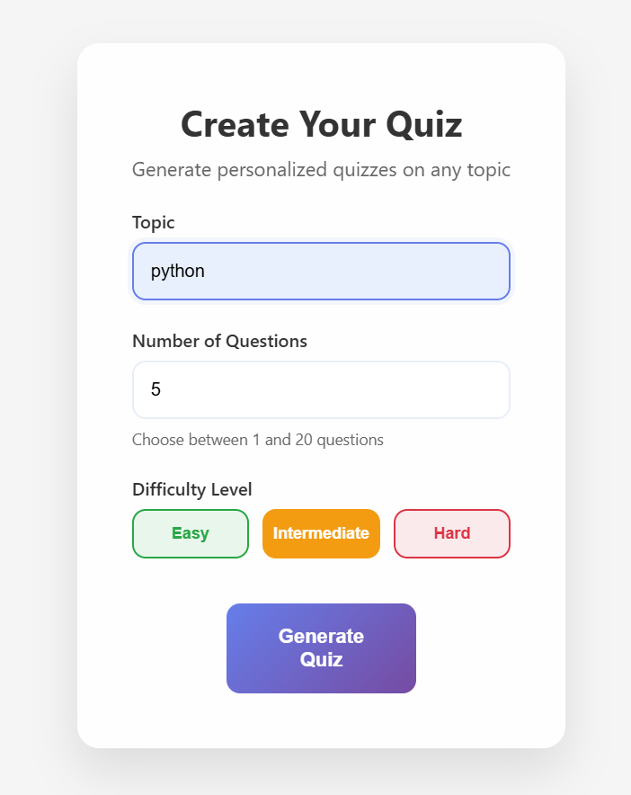
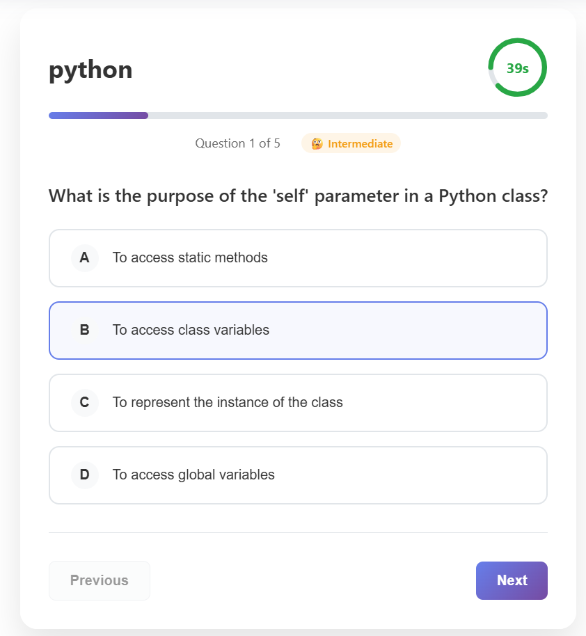
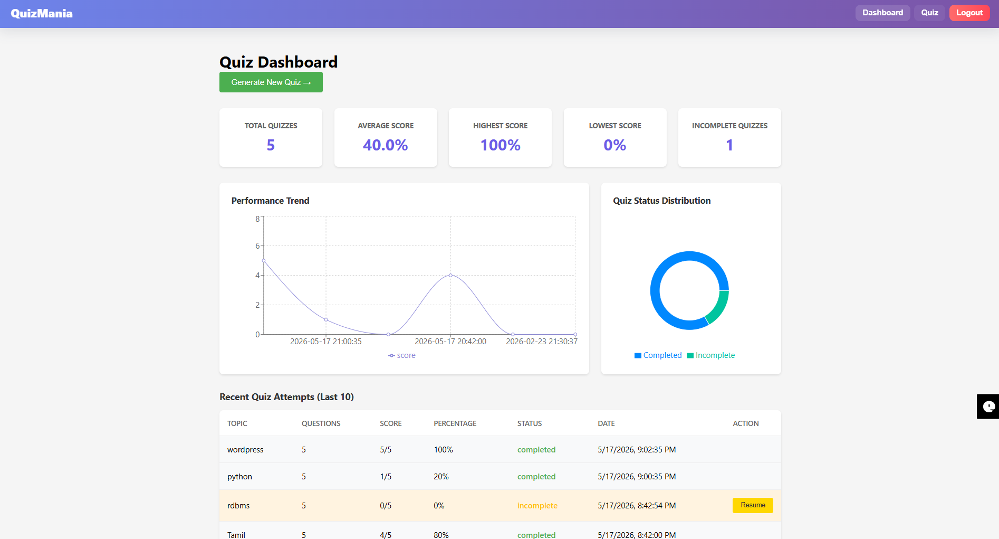

# QuizOMania

An AI-powered quiz generation web application developed using Flask and React TypeScript that dynamically creates personalized quizzes on any topic using the Groq API with the LLaMA 3.3 70B model.

---

## Features

- AI-powered dynamic quiz generation using Groq API
- User authentication with login and registration
- Quiz creation based on topic, difficulty, and question count
- Instant quiz evaluation and score calculation
- Performance dashboard with quiz history tracking
- Responsive React TypeScript frontend
- REST API backend with Swagger documentation
- Modular full-stack application architecture

---

## Technologies Used

| Category | Technologies |
|---|---|
| Frontend | React, TypeScript, HTML5, CSS3 |
| Backend | Python, Flask, Flask-RESTX |
| Database | SQLite |
| APIs | Groq API (LLaMA 3.3 70B) |
| Authentication | Token-based Authentication |
| Documentation | Swagger UI |

---

## Project Architecture

The application was developed using a modular full-stack architecture with separate frontend and backend modules.

The system supports:

- AI-powered quiz generation
- REST API communication
- User authentication
- Dynamic quiz rendering
- Quiz performance tracking
- Modular component-based architecture

---

## Project Structure

```plaintext
quizomania/
├── backend/
│   ├── controllers/
│   ├── database/
│   ├── models/
│   ├── routes/
│   ├── utils/
│   ├── app.py
│   ├── config.py
│   └── requirements.txt
│
├── frontend/
│   ├── public/
│   ├── src/
│   │   ├── components/
│   │   ├── pages/
│   │   ├── services/
│   │   └── utils/
│   │
│   ├── package.json
│   └── tsconfig.json
│
└── README.md
```

---

## Installation and Setup

### Prerequisites

- Python 3.10+
- Node.js v16 or above
- npm
- Groq API Key

---

## Backend Setup

### Navigate to backend folder

```bash
cd backend
```

### Create virtual environment

```bash
python -m venv venv
```

### Activate virtual environment

#### Windows

```bash
venv\Scripts\activate
```

#### macOS/Linux

```bash
source venv/bin/activate
```

### Install dependencies

```bash
pip install -r requirements.txt
```

### Create `.env` file

```env
GROQ_API_KEY=put your api key here
```

### Run backend server

```bash
python app.py
```

Backend runs on:

```plaintext
http://localhost:5000
```

Swagger Documentation:

```plaintext
http://localhost:5000/swagger/
```

---

## Frontend Setup

### Navigate to frontend folder

```bash
cd frontend
```

### Install dependencies

```bash
npm install
```

### Start frontend server

```bash
npm start
```

Frontend runs on:

```plaintext
http://localhost:3000
```

---

## Functional Modules

### Authentication Module

- User registration and login
- Token-based authentication
- Session handling

### Quiz Generation Module

- AI-powered question generation
- Topic and difficulty-based quiz creation
- Dynamic question rendering

### Quiz Evaluation Module

- Instant score calculation
- Answer validation and explanations

### Dashboard Module

- Quiz history tracking
- User performance analytics

### API Module

- RESTful API architecture
- Swagger API documentation
- Frontend-backend communication

---

## Key Concepts Implemented

- Full-stack web development
- REST API integration
- AI API integration
- Authentication and session handling
- React component-based architecture
- Flask backend development
- SQLite database integration
- Modular application structure

---

## Future Enhancements

- Leaderboard system
- Timer-based quizzes
- Quiz sharing functionality
- Admin dashboard
- Cloud database integration

---

## API Endpoints

| Method | Endpoint | Description |
|---|---|---|
| POST | `/api/auth/register` | Register a new user |
| POST | `/api/auth/login` | User login |
| POST | `/api/questions/generate` | Generate quiz questions |
| POST | `/api/quiz/create` | Create quiz session |
| POST | `/api/quiz/submit` | Submit quiz answers |
| GET | `/api/dashboard/stats` | Fetch dashboard statistics |

---
---

## Screenshots

### Login Page



---

### Registration Page



---

### Quiz Generation



---

### Quiz Interface



---

### Quiz Result


---

### Dashboard



---
## Author

**Durgadevi M**

Software Developer | Angular Developer | Python & Data Analytics Learner

---

## License

